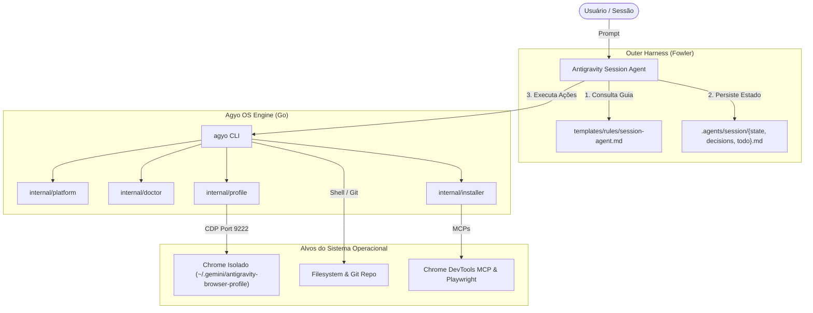

# Arquitetura do Antigravity Operator (`agyo`)

## 1. Visão Geral do Sistema

O `antigravity-operator` opera como uma camada de runtime e governança entre o **Modelo de IA** (como Gemini ou Claude no Antigravity) e o **Sistema Operacional do Desenvolvedor** (macOS ou Linux).

---

## 2. Ciclo de Vida da Sessão

1. **Inicialização (`agyo init`):**
   * Cria o diretório `.agents/session/`.
   * Cria os arquivos `state.md`, `decisions.md` e `todo.md` com templates canônicos caso não existam.
   * Cria `.agents/.gitignore` para impedir que credenciais e dados temporários de depuração sejam commitados acidentalmente.

2. **Diagnóstico da Máquina (`agyo doctor`):**
   * Avalia a saúde da máquina local: Git, Chrome, Node/NPX, exibição gráfica e integração com o `harness-core`.
   * Classifica cada item como `OK`, `WARN`, `FAIL` ou `INFO`.

3. **Orquestração de Navegação (`agyo browser start`):**
   * Lança o Google Chrome restrito ao diretório `~/.gemini/antigravity-browser-profile`.
   * Abre a porta de depuração remota `9222`.
   * Se executado em ambiente Linux sem servidor gráfico (`$DISPLAY`), automaticamente anexa as flags headless essenciais (`--headless=new`, `--disable-dev-shm-usage`, `--no-sandbox`).
   * Faz polling no endpoint `http://127.0.0.1:9222/json/version` até receber status 200 OK.

4. **Sincronização de Regras (`agyo sync`):**
   * Grava as regras canônicas do Session Agent em `~/.gemini/antigravity/rules/session-agent.md`.
   * Prepara os manifestos padrão de MCPs em `~/.gemini/antigravity/mcp/default-servers.json`.

---

## 3. Padrões de Projeto e Decisões de Engenharia

- **Single Responsibility Principle (SRP):** Cada pacote sob `internal/` possui um escopo estrito e não vaza detalhes de implementação para outros pacotes.
- **Embed Nativo (`//go:embed`):** Permite distribuição de binário único sem instaladores complexos ou necessidade de clonar o repositório em todas as máquinas.
- **Zero CGO (`CGO_ENABLED=0`):** Garante compatibilidade binária entre qualquer versão de kernel Linux e biblioteca C (glibc ou musl).
