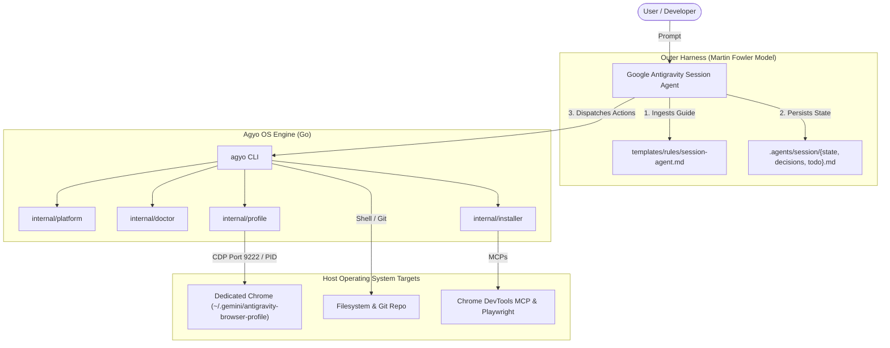

# Antigravity Operator (`agyo`) Architecture Specification

[🇧🇷 Leia em Português](ARCHITECTURE.pt-BR.md)

---

## 1. System Overview

`antigravity-operator` operates as a deterministic runtime and outer harness layer between the **AI Model** (Gemini Pro in Google Antigravity) and the **Developer's Operating System** (macOS or Linux).

---

## 2. Session Lifecycle & State Transitions

1. **Scaffolding (`agyo init`):**
   * Initializes `.agents/session/`.
   * Provisions `state.md`, `decisions.md`, and `todo.md` using canonical templates.
   * Creates `.agents/.gitignore` to prevent secret leaks, debug dumps, and ephemeral runtime logs from entering version control.

2. **Host Diagnostics (`agyo doctor`):**
   * Assesses machine readiness across Git configuration, Chrome installation, Node/NPX availability, display server status (X11/Wayland/Headless), and central `harness-core` integration.
   * Emits deterministic statuses (`OK`, `WARN`, `FAIL`, `INFO`).

3. **Browser Lifecycle & CDP Supervision (`agyo browser`):**
   * Spawns an isolated Google Chrome instance bounded to `~/.gemini/antigravity-browser-profile`.
   * Exposes remote debugging port `9222` (or user-defined `--port`).
   * Automatically falls back to headless flags (`--headless=new`, `--disable-dev-shm-usage`, `--no-sandbox`) when operating in headless Linux servers, Docker containers, or headless WSL2.
   * Tracks process ID in `chrome.pid` and enables graceful teardown via `agyo browser stop` (SIGTERM with SIGKILL timeout fallback).

4. **Rules & Manifesto Sync (`agyo sync`):**
   * Deploys canonical Session Agent directives into `~/.gemini/antigravity/rules/session-agent.md`.
   * Configures standard Model Context Protocol servers in `~/.gemini/antigravity/mcp/default-servers.json`.

---

## 3. Engineering Decisions & Principles

- **Single Responsibility Principle (SRP):** Each internal package (`platform`, `session`, `profile`, `installer`, `doctor`) is strictly decoupled.
- **Embedded Assets (`//go:embed`):** Eliminates external filesystem dependencies at runtime, ensuring offline, self-contained single-binary execution.
- **Pure Go / Zero CGO (`CGO_ENABLED=0`):** Guarantees dynamic linker independence across glibc, musl, and diverse Linux kernel distributions.
