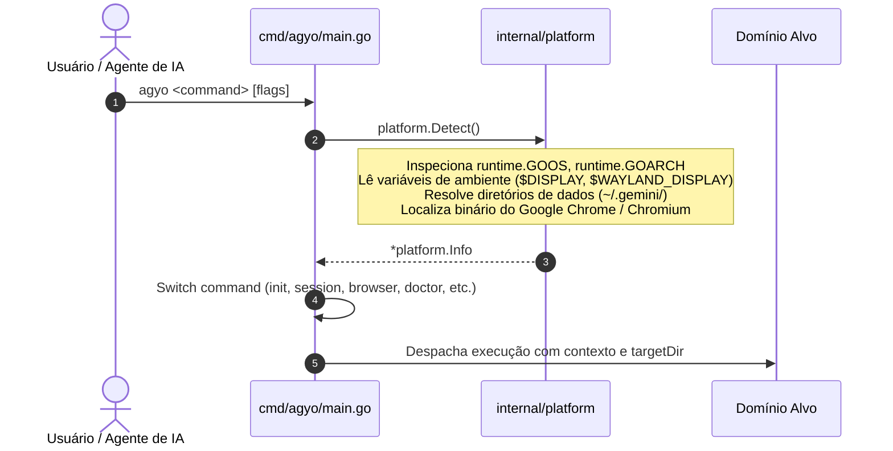

# Domínio 01: Entrada, Detecção de Plataforma e Bootstrap

O pacote `internal/platform` e o entrypoint `cmd/agyo/main.go` formam o portal de entrada do operador. Eles garantem que qualquer comando executado pelo usuário ou por um agente de IA seja inicializado com total compreensão do sistema operacional hospedeiro, arquitetura do processador e disponibilidade de display gráfico.

---

## 1. Fluxo de Entrada e Ciclo de Vida da CLI



---

## 2. A Estrutura de Metadados: `platform.Info`

O tipo `platform.Info` agrega todos os dados operacionais necessários para que os demais subsistemas tomem decisões dinâmicas sem duplicar chamadas ao sistema operacional:

```go
type Info struct {
    OS             string // "darwin", "linux", "windows"
    Arch           string // "arm64", "amd64"
    HomeDir        string // Caminho absoluto para o $HOME do usuário
    HasDisplay     bool   // true se ambiente desktop GUI estiver ativo
    ChromeBin      string // Caminho resolvido para o executável do Chrome/Chromium
    GeminiDir      string // ~/.gemini/antigravity (ou AGY_APP_DATA_DIR)
    BrowserProfile string // ~/.gemini/antigravity-browser-profile
    HarnessCore    string // Caminho resolvido para ~/Github/harness-core
}
```

---

## 3. Decisões Técnicas & Heurísticas de Resolução

### 3.1. Detecção Dinâmica de Ambiente Gráfico (`checkDisplay`)
Um dos maiores gargalos de scripts de IA convencionais é falhar silenciosamente ao rodar em servidores Linux headless, VPSs ou containers Docker porque tentam abrir uma janela gráfica inexistente.

O `agyo` resolve isso na inicialização:
```go
func checkDisplay() bool {
    if runtime.GOOS == "darwin" || runtime.GOOS == "windows" {
        return true
    }
    // No Linux, requer $DISPLAY ou $WAYLAND_DISPLAY configurados
    return os.Getenv("DISPLAY") != "" || os.Getenv("WAYLAND_DISPLAY") != ""
}
```
* **Impacto Arquitetural:** Se `HasDisplay == false`, o subsistema `internal/profile` automaticamente injeta as flags de isolamento headless (`--headless=new`, `--disable-dev-shm-usage`, `--no-sandbox`), garantindo que o agente funcione de forma 100% autônoma em qualquer servidor sem falhas de GPU ou X11.

### 3.2. Resolução do Binário do Chrome (`findChromeBinary`)
O operador utiliza uma cadeia de busca determinística por ordem de prioridade:

1. **Variável de Ambiente Explicita:** `CHROME_BIN` (permite que ambientes de CI ou containers definam um caminho específico).
2. **macOS:**
   - `/Applications/Google Chrome.app/Contents/MacOS/Google Chrome`
   - `/Applications/Chromium.app/Contents/MacOS/Chromium`
3. **Linux / WSL2:**
   Busca no `$PATH` via `exec.LookPath`:
   - `google-chrome`
   - `google-chrome-stable`
   - `chromium-browser`
   - `chromium`

Se nenhum binário for encontrado, o `ChromeBin` retorna vazio. O subsistema `doctor` alerta o usuário e o `profile.Start` falha rapidamente com erro descritivo em vez de gerar um panic.

---

## 4. Design do Parser CLI (Zero External Dependencies)

Em vez de utilizar frameworks de terceiros como `cobra` ou `urfave/cli`, o `agyo` utiliza subconjuntos do pacote padrão `flag.FlagSet`:

- **Vantagem de Performance:** Inicialização em microssegundos (0 dependências no grafo de imports).
- **Vantagem de Tamanho:** Reduz o binário compilado em vários megabytes.
- **Isolamento de Flags:** Cada comando possui seu próprio `flag.NewFlagSet`, permitindo que argumentos posicionais e flags (`--json`, `--fix`, `--force`, `--desc`) sejam interpretados exclusivamente no escopo do comando solicitado.
