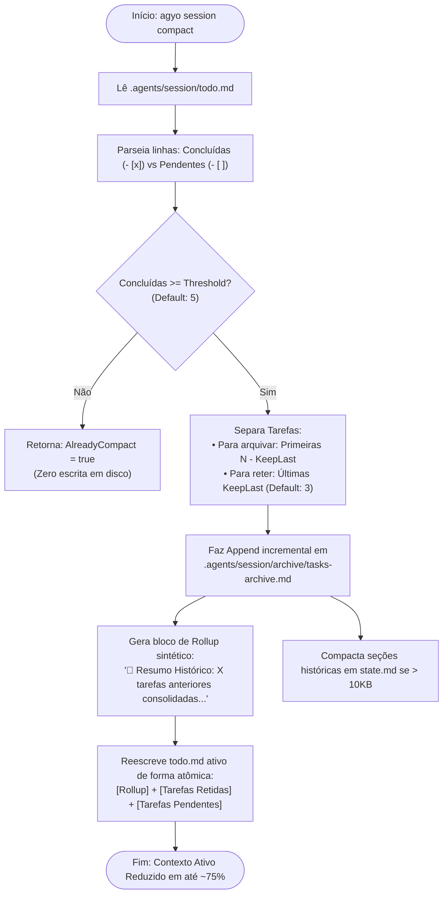

# Domínio 02: Memória Operacional, Compactação e Ciclo de Vida da Sessão

O pacote `internal/session` implementa o coração de governança de memória executiva do `antigravity-operator`. Ele transforma a janela de contexto volátil do modelo de IA em uma **memória persistente estruturada em filesystem**, aplicando o modelo canônico de *Outer Harness* de Martin Fowler.

---

## 1. A Estrutura Canônica em Disco (`.agents/session/`)

Quando um desenvolvedor executa `agyo init`, o operador cria um sandbox hermético de memória no diretório raiz do projeto:

```text
meu-projeto/
├── .agents/
│   ├── .gitignore                # Proteção contra vazamento de logs e arquivos de sessão
│   └── session/
│       ├── state.md              # Objetivo ativo, status atual, bloqueios e próximas ações
│       ├── decisions.md          # Log imutável de decisões arquiteturais e trade-offs
│       ├── todo.md               # Lista de tarefas ativas (concluídas, em progresso e pendentes)
│       ├── checkpoints.json      # Catálogo de instantâneos atômicos de segurança do filesystem
│       └── archive/              # Histórico de sessões passadas e tarefas compactadas
│           ├── tasks-archive.md  # Rollup cumulativo de tarefas antigas
│           └── session-*.md      # Snapshots completos de sessões arquivadas
└── .agentignore                  # Lista negra de tokens contextuais (node_modules, dumps, etc.)
```

---

## 2. O Problema da Degradação de Contexto (Context Bloat)

À medida que um agente autônomo executa um sprint com 20, 50 ou 100 interações:
1. O acúmulo de tarefas completadas (`- [x] Tarefa concluída`) polui a janela de contexto.
2. Cada turno subsequente do modelo consome tokens repetidamente lendo tarefas antigas já finalizadas.
3. A atenção do modelo se fragmenta, gerando alucinações, esquecimento de diretrizes anteriores e aumento exponencial no custo de API.

---

## 3. O Algoritmo de Compactação $O(1)$ (`session.Compact`)

Para resolver essa degradação, o `agyo` implementa um algoritmo determinístico de **Rollup & Compaction**:



### 3.1. Benchmarking de Performance
O compactor foi submetido a testes de benchmark em hardware com processador Apple Silicon e Linux amd64:
- **Tempo médio de execução para 100 tarefas:** **`0.19 ms` (193.604 ns/op)**.
- **Alocação de Memória:** Menos de 40 KB por operação.
- **Complexidade:** $O(N)$ no momento da compactação, mantendo o contexto executivo subsequente em **estrito $O(1)$**.

---

## 4. Telemetria Visual de Saúde da Memória (`HealthStatus`)

Ao executar `agyo session status`, o operador analisa o tamanho total em bytes dos arquivos de sessão e estima os tokens equivalentes (fator $1 \text{ token} \approx 4 \text{ bytes}$ para markdown técnico):

| Footprint em Bytes | Status Visual | Ação Recomendada |
|---|:---:|---|
| **< 8.000 Bytes** (~2.000 tokens) | **Optimal 🟢** | Operação livre. O modelo está afiado e em velocidade máxima. |
| **8.000 a 20.000 Bytes** (~5.000 tokens) | **Moderate 🟡** | Alerta preventivo sugerindo compactação. |
| **> 20.000 Bytes** (> 5.000 tokens) | **Bloated 🔴** | Inchaço crítico de contexto. O operador recomenda explicitamente `agyo session compact`. |

---

## 5. Ciclo de Arquivamento e Restauração Segura (`archive` & `restore`)

Quando uma missão de grande porte é finalizada, o usuário ou agente executa `agyo session archive`:
1. Gera um artefato consolidado: `.agents/session/archive/session-YYYY-MM-DD-HHMMSS.md`.
2. Contém o cabeçalho temporal, o conteúdo exato de `state.md` e `todo.md` separados por um divisor canônico `---`.
3. Reseta `state.md` e `todo.md` com templates limpos para o próximo ciclo de trabalho.

### 5.1. Restauração com Backup Preventivo (`session.Restore`)
Ao executar `agyo session restore <nome-do-arquivo|latest>`:
1. O operador localiza e valida o arquivo histórico no diretório de arquivo.
2. Cria **automaticamente um snapshot de segurança** do estado atual antes da sobrescrita (`archive/pre-restore-YYYY-MM-DD-HHMMSS.md`).
3. Restaura o objetivo, fase e lista de tarefas anteriores para `state.md` e `todo.md`.
4. Garante que nenhuma decisão ou tarefa em andamento seja perdida por erro operacional.

---

## 6. Decisões Técnicas & Trade-Offs do Subsistema de Memória

| Decisão | O Que Foi Escolhido | Alternativa Rejeitada | Racional & Trade-Off |
|---|---|---|---|
| **Estratégia de Compactação** | **Rollup Determinístico Estruturado** | Usar LLM para resumir as tarefas anteriores | **Vantagem:** Execução em **0.19 ms**, zero consumo de cota de API, determinismo absoluto e sem risco de alucinação no resumo.<br>**Trade-off:** O bloco de rollup é sintético estruturado (contadores e últimas tarefas) em vez de uma narrativa rica em prosa. |
| **Ponto de Gatilho da Compactação** | **Threshold de 5 tarefas (KeepLast: 3)** | Compactar a cada tarefa concluída ou deixar acumular 50+ | **Vantagem:** Equilibra estabilidade contextual sem acionar I/O de disco a cada turno e evita context bloat.<br>**Trade-off:** Até 4 tarefas concluídas ainda coexistem no `todo.md` ativo antes do disparo. |
| **Garantia de Não-Perda no Restore** | **Backup preventivo obrigatório (`pre-restore-*.md`)** | Sobrescrever direto os arquivos ativos | **Vantagem:** Impossível o desenvolvedor ou a IA perder acidentalmente o estado atual ao alternar para uma sessão antiga.<br>**Trade-off:** Gera um arquivo markdown extra em `.agents/session/archive/`. |

