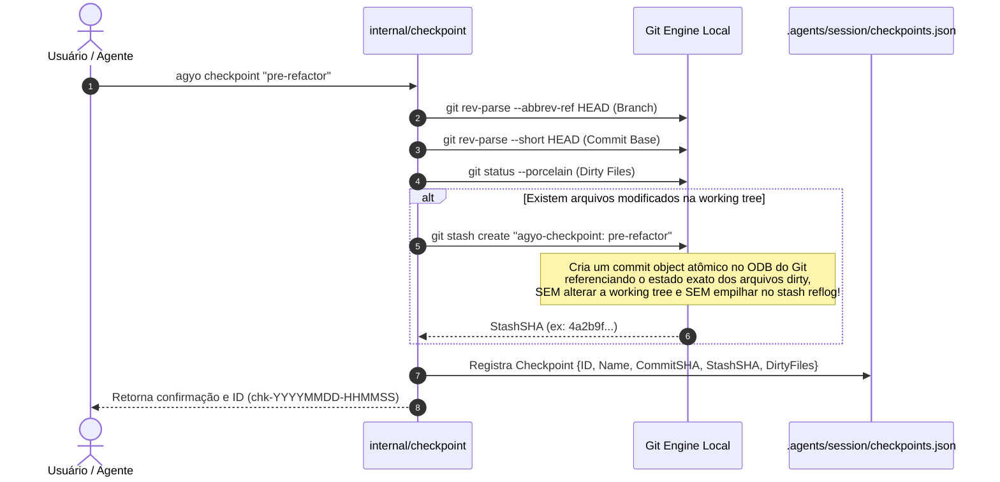

# Domínio 04: Filesystem Safety Net, Checkpoints e Rollback

O pacote `internal/checkpoint` fornece uma rede de segurança atômica baseada no Git Porcelain para permitir que agentes de IA realizem refatorações complexas em múltiplos arquivos sem risco de corrupção irreparável do repositório.

---

## 1. O Problema: Refatorações Destrutivas de Agentes

Ao encarar tarefas que envolvem renomear pacotes, alterar contratos de APIs ou migrar bancos de dados, modelos de linguagem frequentemente entram em loops de edições parciais:
1. O agente altera 8 arquivos com sucesso.
2. No 9º arquivo, ele erra a sintaxe ou alucina uma dependência.
3. Ao tentar consertar o 9º arquivo, o agente edita os arquivos anteriores novamente, gerando um estado de trabalho caótico e quebrado.
4. Sem um ponto de restauração atômico, o desenvolvedor é forçado a inspecionar diffs manuais extensos para desfazer a lambança.

---

## 2. A Solução: Checkpoints Atômicos via Git Stash Commit Objects

A maioria das ferramentas concorrentes comete o erro de criar "commits falsos" no histórico do Git (`git commit -m "temp aider checkpoint"`), poluindo o `git log` com centenas de commits de teste que precisam ser limpos depois com `git rebase -i`.

O `agyo` utiliza uma abordagem matematicamente superior: **Git Stash Commit Objects sem tocar na working tree**.



---

## 3. O Estrutura do Checkpoint (`checkpoints.json`)

Cada snapshot é gravado de forma estruturada em `.agents/session/checkpoints.json`:

```json
[
  {
    "id": "chk-20261001-113000",
    "name": "pre-refactor",
    "timestamp": "2026-10-01T11:30:00-03:00",
    "commit_sha": "a86a37d",
    "branch": "main",
    "dirty_files": [
      "M internal/profile/cdp.go",
      "?? novo_arquivo_teste.go"
    ],
    "stash_sha": "f1d2e3c4b5a6071829304152637485960718293a",
    "description": "Antes de alterar migrations do banco"
  }
]
```

---

## 4. O Botão de Pânico: `agyo rollback`

Quando uma intervenção do modelo de IA desanda, o desenvolvedor ou o próprio agente pode emitir o comando de restauração instantânea:

```bash
agyo rollback
# ou para um checkpoint específico:
agyo rollback chk-20261001-113000
```

### 4.1. Algoritmo de Rollback
1. **Verificação de Repositório Git:** Valida se o diretório alvo está dentro de um repositório git ativo (`git rev-parse --is-inside-work-tree`).
2. **Resolução de Checkpoint:** Se nenhum ID for passado (ou `latest`), seleciona o instantâneo mais recente gravado em `checkpoints.json`.
3. **Limpeza Cirúrgica:**
   - `git reset --hard HEAD`: Descarta edições corrompidas de arquivos rastreados.
   - `git clean -fd`: Remove todos os arquivos e diretórios novos ou untracked criados pelo agente durante o erro.
4. **Reaplicação de Estado:**
   - Se o checkpoint continha `StashSHA`, executa `git stash apply <StashSHA>`, restaurando as edições legítimas que existiam no momento do snapshot.
   - Se o checkpoint era de working tree limpa, restaura o ponteiro para o `CommitSHA` de referência.
5. **Auditoria no Log de Sessão:**
   - O operador anexa automaticamente uma nota de auditoria em `.agents/session/state.md`:
     `> ⚠️ *Rollback efetuado para o checkpoint 'pre-refactor' (chk-20261001-113000) em 2026-10-01 11:35:10*`
   - Isso garante que a próxima janela de contexto do agente saiba que o refatoramento falhou e foi revertido com segurança.
