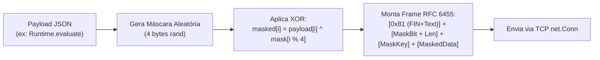

# Domínio 05: Supervisão do Chrome e Cliente DevTools Protocol (CDP) Nativo em Go

O pacote `internal/profile` é um dos módulos mais sofisticados do `antigravity-operator`. Ele fornece controle de ciclo de vida completo sobre uma instância isolada do Google Chrome/Chromium e implementa um **cliente WebSocket RFC 6455 nativo do Chrome DevTools Protocol (CDP)** sem usar nenhuma biblioteca externa (zero Node.js, zero Puppeteer, zero Playwright, zero bibliotecas CGO).

---

## 1. Por Que Isolamento de Navegador é Crítico?

A maioria dos assistentes de IA convencionais tenta usar a pasta de perfil pessoal do usuário (`~/Library/Application Support/Google/Chrome/Default` no Mac ou `~/.config/google-chrome/Default` no Linux). Isso cria riscos gravíssimos:
1. **Risco de Segurança:** O modelo de IA pode acessar cookies de sessão de bancos, e-mails pessoais e credenciais corporativas salvas.
2. **Conflito de Locks:** O Chrome bloqueia o arquivo `SingletonLock` do perfil. Se o usuário já estiver com o Chrome aberto, o agente falha ao iniciar.
3. **Poluição de Histórico:** Centenas de abas de teste automatizadas poluem o histórico e as janelas pessoais do desenvolvedor.

### 1.1. A Abordagem do `agyo`
O operador define um diretório de perfil estritamente isolado:
- Caminho: `~/.gemini/antigravity-browser-profile`
- Porta Padrão de Remote Debugging: `9222` (configurável via `--port`)
- Arquivo de Rastreamento de Processo: `chrome.pid` gravado no perfil.

---

## 2. Injeção Dinâmica de Flags de Execução (`profile.Start`)

Ao inicializar o Chrome, o `agyo` monta dinamicamente a linha de comando baseando-se na presença de display e no sistema operacional:

```go
args := []string{
    fmt.Sprintf("--remote-debugging-port=%d", port),
    fmt.Sprintf("--user-data-dir=%s", info.BrowserProfile),
    "--no-first-run",
    "--no-default-browser-check",
    "--disable-background-networking",
    "--disable-client-side-phishing-detection",
    "--disable-component-update",
    "--disable-default-apps",
    "--disable-domain-reliability",
    "--disable-sync",
}

// Injeção dinâmica para ambientes headless (servidores Linux / Docker / WSL2)
if headless || !info.HasDisplay {
    args = append(args,
        "--headless=new",
        "--disable-gpu",
        "--disable-dev-shm-usage", // Previne crashes de memória compartilhada em Docker
        "--no-sandbox",            // Permite execução em containers sem privilégios root
    )
}
```

---

## 3. A Implementação Pura do Cliente WebSocket CDP (RFC 6455)

Para enviar comandos de automação (`Runtime.evaluate`, `Page.captureScreenshot`, listagem de abas) ao Chrome sem instalar Node.js ou dependências pesadas, o arquivo `internal/profile/cdp.go` implementa o protocolo WebSocket diretamente sobre sockets TCP (`net.DialTimeout`).

### 3.1. Handshake HTTP Upgrade
1. Conecta via TCP em `127.0.0.1:<port>`.
2. Gera chave aleatória de 16 bytes e codifica em Base64 (`Sec-WebSocket-Key`).
3. Envia cabeçalho HTTP 1.1 solicitando Upgrade para WebSocket.
4. Valida a resposta do Chrome (`HTTP/1.1 101 Switching Protocols`).

### 3.2. Formatação de Frames Binários com Máscara
Conforme a especificação RFC 6455, **toda mensagem enviada de um cliente para o servidor WebSocket precisa obrigatoriamente ser mascarada**:



### 3.3. Leitura e Decodificação de Frames
Ao receber a resposta do Chrome:
1. Lê o primeiro byte (FIN bit e Opcode 0x1 para texto).
2. Lê o tamanho do payload (suportando tamanhos de 7 bits, 16 bits estendidos ou 64 bits).
3. Lê os dados brutos e faz o parse do JSON da resposta CDP.

---

## 4. Comandos CDP Expostos na CLI

O desenvolvedor e os agentes podem interagir com a instância do Chrome através de subcomandos simples:

| Comando | Método CDP Invocado | O Que Faz |
|---|---|---|
| `agyo browser tabs` | HTTP GET `/json` | Lista todas as abas abertas, títulos e seus WebSocket Debugger URLs. |
| `agyo browser open <url>` | HTTP PUT `/json/new?<url>` | Abre uma nova aba com a URL especificada no Chrome isolado. |
| `agyo browser close <id>` | HTTP GET `/json/close/<id>` | Fecha uma aba específica identificada pelo target ID. |
| `agyo browser eval "<js>"` | `Runtime.evaluate` | Avalia qualquer expressão JavaScript na aba ativa e retorna o valor serializado. |
| `agyo browser shot [file]` | `Page.captureScreenshot` | Captura a imagem renderizada da página em formato PNG base64 e salva no disco. |
| `agyo browser stop` | Sinais SIGTERM / SIGKILL | Encerra o processo do Chrome de forma graciosa limpando o arquivo de PID. |

---

## 5. Estratégia de Testes Unitários com Mock TCP Server

Para garantir que o código do cliente WebSocket CDP seja testado em ambientes de integração contínua (CI) onde o Google Chrome não está instalado, o arquivo `cdp_test.go` inclui um servidor mock TCP que implementa:
1. Resposta ao endpoint HTTP `/json` com lista sintética de abas.
2. Handshake completo RFC 6455 (`Sec-WebSocket-Accept` calculado com SHA-1 + Magic GUID `258EAFA5-E914-47DA-95CA-C5AB0DC85B11`).
3. Decodificação de frames mascarados do cliente e envio de frames sem máscara com respostas mockadas de JavaScript e captura de tela (1x1 PNG base64).
4. Essa suíte garante **70.9% de cobertura de código no pacote `internal/profile`** sem depender de software externo.

---

## 6. Decisões Técnicas & Trade-Offs

| Decisão | O Que Foi Escolhido | Alternativa Rejeitada | Racional & Trade-Off |
|---|---|---|---|
| **Cliente WebSocket CDP** | **Implementação nativa RFC 6455 stdlib (`net.Conn`)** | Importar `gorilla/websocket` ou orquestrar via Puppeteer/Playwright | **Vantagem:** Zero dependências no `go.mod`, binário portátil de 8MB, controle milimétrico de timeouts e framing.<br>**Trade-off:** Precisamos escrever e manter o bit-masking e parsing binário de frames RFC 6455 internamente. |
| **Isolamento de Perfil** | **Diretório dedicado `~/.gemini/antigravity-browser-profile`** | Usar a pasta de dados de usuário padrão do Chrome (`Default`) | **Vantagem:** Zero risco de fechar as abas pessoais do desenvolvedor, vazar senhas ou colidir cookies pessoais com testes de desenvolvimento.<br>**Trade-off:** O desenvolvedor precisa fazer login em serviços de desenvolvimento dentro do perfil dedicado da IA uma primeira vez. |
| **Testes sem Chrome Físico** | **Mock TCP Server com handshake e frames simulados** | Exigir Chrome instalado ou pular testes em CI | **Vantagem:** CI passa em Linux headless, macOS e containers sem instalar o binário do Google Chrome.<br>**Trade-off:** O mock valida a conformidade do protocolo e do frame reader, mas não substitui testes end-to-end de renderização real do browser. |
