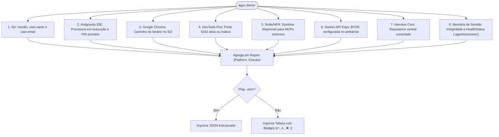

# Domínio 07: Sensores de Diagnóstico, Self-Healing e Pre-Commit Hook

O outer harness de Martin Fowler se divide em dois vetores: **Guias** (o que o modelo deve fazer antes de codar) e **Sensores** (o que valida e protege o ambiente durante e após a execução).

Os pacotes `internal/doctor` e `internal/hook` compõem a camada sensorial computacional do `antigravity-operator`.

---

## 1. O Diagnóstico Computacional (`internal/doctor`)

O comando `agyo doctor` realiza uma varredura em 8 dimensões vitais da máquina do desenvolvedor:



---

## 2. Sensor de Autorrecuperação (Self-Healing): `agyo doctor --fix`

Em cenários reais de desenvolvimento, acidentes acontecem:
- Um comando `rm -rf` apaga o `.agentignore`.
- O desenvolvedor clona um projeto novo e esquece de rodar `agyo init`.
- Um script limpa acidentalmente o `.agents/.gitignore`.

O `agyo doctor --fix` age como um **sensor corretivo idempotente**:
1. Inspeciona a árvore do projeto alvo.
2. Identifica quais arquivos da memória de sessão e proteções estão ausentes.
3. Recria estritamente o que estiver faltando (`Repaired: []`).
4. Preserva integralmente qualquer arquivo que já exista (`Skipped: []`), garantindo que notas, decisões anteriores e tarefas em andamento **nunca sejam sobrescritas**.
5. Retorna um resumo legível no terminal ou JSON estruturado com `--json`.

---

## 3. Contrato Machine-Readable: `--json` Unificado

Para permitir que o `agyo` seja consumido programaticamente por:
- Extensões do VS Code / Cursor / JetBrains
- Pipelines de CI/CD (GitHub Actions / GitLab CI)
- Scripts de automação em Bash ou Python
- Outros agentes de IA autônomos

Todos os comandos de consulta do operador suportam a flag `--json`:

```bash
agyo doctor --json
agyo session status --json
agyo session list --json
agyo checkpoint --list --json
```

O output em stdout é garantido como JSON RFC 8259 puro e válido, permitindo processamento direto com ferramentas como `jq`:
```bash
# Exemplo: Verificar se a sessão está bloated via shell script
STATUS=$(agyo session status --json | jq -r '.health_status')
if [[ "$STATUS" == *"Bloated"* ]]; then
    agyo session compact
fi
```

---

## 4. O Gate de Continuidade Pré-Commit (`internal/hook`)

Desenvolvedores e agentes frequentemente cometem o erro de comitar alterações de código no Git sem atualizar o status da sessão em `.agents/session/state.md` e `todo.md`. Isso quebra a continuidade da sessão e faz com que a próxima janela de contexto da IA comece cega.

### 4.1. Instalação e Funcionamento
Ao executar `agyo hook install`:
1. O operador escreve um script executável em `.git/hooks/pre-commit`.
2. Antes de qualquer `git commit` ser aceito pelo Git, o hook:
   - Executa `go vet ./...` (análise estática).
   - Executa os testes unitários (`go test`).
   - Verifica se os arquivos de sessão foram atualizados ou se há pendências críticas.
   - Rejeita o commit caso haja falhas no código ou inconsistências de sessão.

Para remover o hook quando necessário, basta executar `agyo hook uninstall`.
