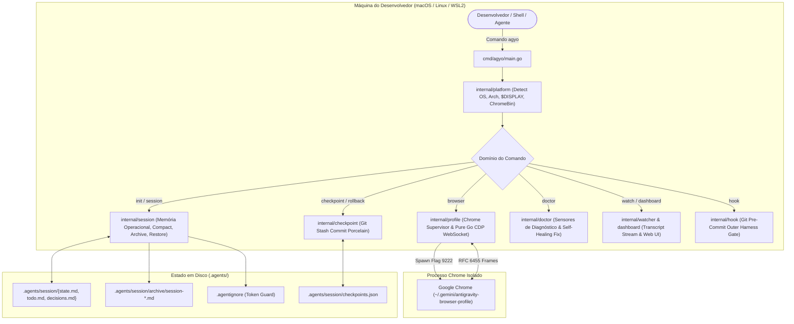

# Especificação de Engenharia e Arquitetura Canônica (`agyo`)

Bem-vindo à documentação aprofundada de arquitetura e design de sistemas do **Antigravity Operator (`agyo`)**.

Esta documentação foi desenhada para engenheiros de software, pesquisadores, arquitetos de IA e colaboradores open source que desejam entender **cada decisão técnica, cada camada de abstração, as garantias de complexidade computacional e o fluxo determinístico ponta a ponta** do operador.

---

## 🏛️ Filosofia de Design e Princípios Fundamentais

O `agyo` foi construído sob quatro pilares inegociáveis de engenharia de software:

1. **Outer Harness Canônico (Martin Fowler):**
   Modelos de linguagem (LLMs) são motores probabilísticos atômicos. Sem um *outer harness* determinístico que forneça **Guias (Feedforward)** antes da execução e **Sensores (Feedback)** durante e após a execução, agentes inevitavelmente entram em *drifting*, repetição de erros e alucinação de paths.

2. **Zero Runtime Dependencies (Pure Go Standard Library):**
   O repositório mantém um `go.mod` estritamente limpo de bibliotecas externas de terceiros. Da camada de rede ao protocolo binário WebSocket RFC 6455 do Chrome DevTools, todo o runtime foi implementado utilizando **exclusivamente a biblioteca padrão do Go (`net`, `net/http`, `os`, `encoding/json`, `crypto`, `bufio`)**. Isso elimina riscos de *supply-chain attacks*, incompatibilidade entre kernels Linux e atrito de instalação.

3. **Complexidade de Memória Bounded a $O(1)$:**
   À medida que turnos de conversa avançam em sprints de código longos, o acúmulo linear de contexto degrada a atenção e a assertividade do modelo. O subsistema de sessão do `agyo` garante que a memória executiva ativa permaneça em tamanho constante através de compactação com rollup e arquivamento out-of-band.

4. **Isolamento de Segurança e Fronteiras Herméticas:**
   Agentes de IA nunca devem ter acesso ao perfil pessoal de navegação do usuário (cookies de banco, senhas, sessões corporativas). O operador instancia e comanda um sandbox dedicado do Google Chrome com porta e PID estritamente gerenciados.

---

## 🗺️ Mapa de Domínios da Arquitetura

A especificação completa está modularizada por domínios de responsabilidade única (SRP):

| Domínio | Especificação | O Que Cobre |
|---|---|---|
| **01. Entrada & Lifecycle** | [01-ENTRADA-E-BOOTSTRAP.md](01-ENTRADA-E-BOOTSTRAP.md) | Detecção de SO/arch, resolução de display server, CLI dispatcher, parsing de flags e bootstrap. |
| **02. Memória & Sessão** | [02-MEMORIA-OPERACIONAL-E-SESSAO.md](02-MEMORIA-OPERACIONAL-E-SESSAO.md) | `.agents/session/`, algoritmos de rollup $O(1)$, compaction em 0.19 ms, listagem e restauração com backup preventivo. |
| **03. Token Protection** | [03-TOKEN-GUARD-E-AGENTIGNORE.md](03-TOKEN-GUARD-E-AGENTIGNORE.md) | `.agentignore`, heurísticas de exclusão de lockfiles, minificados, dumps e prevenção de context bloat. |
| **04. Safety Net & Git** | [04-FILESYSTEM-SAFETY-NET-CHECKPOINT.md](04-FILESYSTEM-SAFETY-NET-CHECKPOINT.md) | Snapshots atômicos via `git stash create`, restauração via rollback e botão de pânico sem poluir o histórico git. |
| **05. Chrome & CDP** | [05-SUPERVISAO-CHROME-E-CDP-PURO.md](05-SUPERVISAO-CHROME-E-CDP-PURO.md) | Perfil isolado, flags headless dinâmicas, PID tracking e implementação nativa de cliente WebSocket RFC 6455 para Chrome DevTools Protocol. |
| **06. Observabilidade & Watch** | [06-OBSERVABILIDADE-WATCHER-E-DASHBOARD.md](06-OBSERVABILIDADE-WATCHER-E-DASHBOARD.md) | Streaming JSONL reativo de transcript, árvore de subagentes concorrente, alertas nativos de SO e Dashboard Web HTTP. |
| **07. Sensores & Self-Healing** | [07-SENSORES-DOCTOR-E-SELF-HEALING.md](07-SENSORES-DOCTOR-E-SELF-HEALING.md) | Diagnóstico computacional, pre-commit hook de continuidade, autorrecuperação (`doctor --fix`) e contrato machine-readable `--json`. |

---

## 🔄 Visão Panorâmica do Fluxo de Execução

